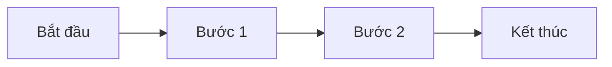
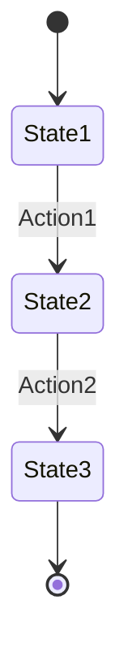

# Template: [Tên Module Nghiệp vụ]

> Mô tả ngắn gọn module trong 1-2 câu.

---

## 1. Tổng quan

### 1.1. Mục đích
[Module này giải quyết vấn đề gì?]

### 1.2. Phạm vi
[Phạm vi của module: những gì bao gồm và không bao gồm]

---

## 2. Đối tượng sử dụng

| Vai trò | Quyền hạn trong module |
|---------|------------------------|
| [Role 1] | [Có thể làm gì] |
| [Role 2] | [Có thể làm gì] |

---

## 3. Quy trình chính

### 3.1. [Quy trình 1]

**Mô tả**: [Mô tả quy trình]

**Luồng xử lý**:

**Điều kiện**:
- [Điều kiện 1]
- [Điều kiện 2]

### 3.2. [Quy trình 2]

[Mô tả tương tự]

---

## 4. Quy tắc nghiệp vụ

### 4.1. [Tên quy tắc 1]

| Thuộc tính | Chi tiết |
|------------|----------|
| **Mô tả** | [Mô tả quy tắc] |
| **Điều kiện áp dụng** | [Khi nào áp dụng] |
| **Kết quả** | [Kết quả khi áp dụng] |
| **Ngoại lệ** | [Ngoại lệ nếu có] |

### 4.2. [Tên quy tắc 2]

[Mô tả tương tự]

---

## 5. Trạng thái (nếu có)

| Trạng thái | Mô tả | Cho phép hành động |
|------------|-------|-------------------|
| [State 1] | [Mô tả] | [Actions có thể thực hiện] |
| [State 2] | [Mô tả] | [Actions có thể thực hiện] |

---

## 6. Entities chính

### 6.1. [Entity 1]

| Thuộc tính | Mô tả | Bắt buộc |
|------------|-------|----------|
| [Attribute 1] | [Mô tả] | Có/Không |
| [Attribute 2] | [Mô tả] | Có/Không |

### 6.2. [Entity 2]

[Mô tả tương tự]

---

## 7. Tích hợp với Module khác

| Module | Quan hệ | Mô tả |
|--------|---------|-------|
| [Module A] | [Loại quan hệ] | [Chi tiết] |
| [Module B] | [Loại quan hệ] | [Chi tiết] |

---

## Tài liệu liên quan

- [Tổng quan nghiệp vụ](../overview.md)
- [Tài liệu tính năng - Module này](../../2_features_docs/[module]/)
- [Tài liệu kỹ thuật - Module này](../../3_technical_docs/[module]/)

