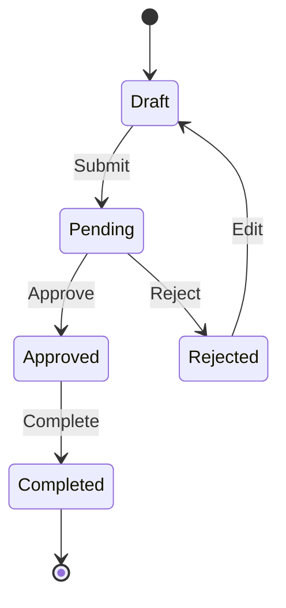

# Template: Tổng quan Nghiệp vụ

> Mô tả ngắn gọn hệ thống trong 1-2 câu.

---

## 1. Giới thiệu

### 1.1. Mục đích tài liệu
Tài liệu này mô tả tổng quan nghiệp vụ của hệ thống **[Tên hệ thống]**.

### 1.2. Phạm vi
[Mô tả phạm vi hệ thống: đối tượng phục vụ, quy mô, các lĩnh vực liên quan]

---

## 2. Mục tiêu dự án

### 2.1. [Mục tiêu 1]
[Mô tả mục tiêu và các benefits]

### 2.2. [Mục tiêu 2]
[Mô tả mục tiêu và các benefits]

### 2.3. [Mục tiêu N] *(Giai đoạn sau)*
[Mô tả mục tiêu sẽ triển khai trong tương lai]

---

## 3. Đối tượng người dùng

| Vai trò | Mô tả | Chức năng chính |
|---------|-------|-----------------|
| **[Role 1]** | [Mô tả vai trò] | [Chức năng chính] |
| **[Role 2]** | [Mô tả vai trò] | [Chức năng chính] |
| **[Role N]** | [Mô tả vai trò] | [Chức năng chính] |

> **Lưu ý:** [Ghi chú đặc biệt về vai trò nếu có]

---

## 4. Các loại nghiệp vụ chính

### 4.1. [Nghiệp vụ 1]
- [Mô tả chi tiết]
- [Yêu cầu đầu vào]
- [Kết quả đầu ra]

### 4.2. [Nghiệp vụ 2]
- [Mô tả chi tiết]

### 4.3. [Nghiệp vụ N]
- [Mô tả chi tiết]

---

## 5. Quy trình nghiệp vụ tổng quan

### 5.1. Luồng xử lý cơ bản

```
┌─────────────┐     ┌─────────────┐     ┌─────────────┐     ┌─────────────┐
│  Bước 1     │────►│  Bước 2     │────►│  Bước 3     │────►│  Bước 4     │
│  [Mô tả]    │     │  [Mô tả]    │     │  [Mô tả]    │     │  [Mô tả]    │
└─────────────┘     └─────────────┘     └─────────────┘     └─────────────┘
```

### 5.2. Luồng phân nhánh (nếu có)

[Mô tả các nhánh xử lý khác nhau dựa trên điều kiện]

### 5.3. Các trạng thái



---

## 6. [Domain concept quan trọng 1]

### 6.1. Nguyên tắc
[Mô tả nguyên tắc cốt lõi]

### 6.2. Chi tiết
[Mô tả chi tiết với ví dụ]

**Ví dụ:**
```
[Ví dụ minh họa bằng text hoặc diagram]
```

---

## 7. [Domain concept quan trọng 2]

### 7.1. Các loại [concept]
| Loại | Mô tả |
|------|-------|
| [Loại 1] | [Mô tả] |
| [Loại 2] | [Mô tả] |

### 7.2. Quy tắc
[Mô tả các quy tắc nghiệp vụ]

---

## 8. Kiến trúc Module

### 8.1. Tổng quan

```
┌─────────────────────────────────────────────────────────────────────┐
│                         HỆ THỐNG [TÊN]                              │
├─────────────────────────────────────────────────────────────────────┤
│                                                                     │
│  ┌─────────────┐  ┌─────────────┐  ┌─────────────┐                 │
│  │  MODULE 1   │  │  MODULE 2   │  │  MODULE 3   │                 │
│  └─────────────┘  └─────────────┘  └─────────────┘                 │
│                                                                     │
│  ┌─────────────────────────────────────────────────────────────┐    │
│  │                    SHARED SERVICES                          │    │
│  └─────────────────────────────────────────────────────────────┘    │
│                                                                     │
└─────────────────────────────────────────────────────────────────────┘
```

### 8.2. [Module 1]

| Chức năng | Mô tả |
|-----------|-------|
| **[Chức năng 1]** | [Mô tả] |
| **[Chức năng 2]** | [Mô tả] |

### 8.3. [Module 2]

[Mô tả tương tự]

### 8.4. Shared Services

| Service | Mô tả |
|---------|-------|
| **[Service 1]** | [Mô tả] |
| **[Service 2]** | [Mô tả] |

---

## 9. Ma trận Module - Vai trò

| Module / Chức năng | [Role 1] | [Role 2] | [Role 3] | [Role N] |
|--------------------|:--------:|:--------:|:--------:|:--------:|
| **[Module 1]**     | ✓        | -        | ✓        | -        |
| **[Module 2]**     | -        | ✓        | ✓        | ✓        |
| **[Module 3]**     | ✓        | ✓        | -        | -        |

---

## 10. Phụ lục

### 10.1. Thuật ngữ
> Xem chi tiết tại [glossary.md](./glossary.md)

| Thuật ngữ | Giải thích |
|-----------|------------|
| [Term 1]  | [Giải thích] |
| [Term 2]  | [Giải thích] |

### 10.2. Tài liệu liên quan

- [Module 1](./[module_01]/)
- [Module 2](./[module_02]/)
- [Tài liệu tính năng](../2_features_docs/)
- [Tài liệu kỹ thuật](../3_technical_docs/)

