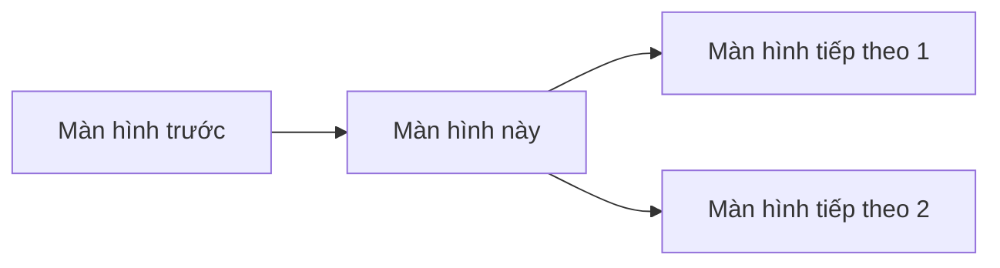
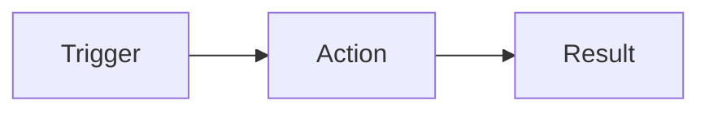

# Template: [Tên màn hình]

> Mô tả ngắn về mục đích của màn hình.

---

## Thông tin chung

| Thuộc tính | Giá trị |
|------------|---------| 
| Page Title | [Tiêu đề trang hiển thị trên browser tab] |
| URL | `/[module]/[screen-name]` |
| Route Name | [Tên route, nếu có] |
| Quyền truy cập | [Tên permission] |
| Breadcrumb | Home > [Module] > [Screen] |

---

## Thành phần dùng chung

> **QUAN TRỌNG:** Đọc kỹ các tài liệu dưới đây trước khi thiết kế màn hình.

**Layouts:**
- [Main Layout](../shared/layouts/main-layout.md) - Bố cục chính

**Components:**
- [Tables](../shared/components/tables.md) - Bảng dữ liệu, toolbar, phân trang
- [Forms](../shared/components/forms.md) - Form elements, validation states
- [Modals](../shared/components/modals.md) - Dialog, confirm, form modal
- [Buttons](../shared/components/buttons.md) - Button types, states
- [Cards](../shared/components/cards.md) - Card, panel, tabs

**Patterns:**
- [Validation](../shared/patterns/validation.md) - Quy tắc validation
- [Pagination](../shared/patterns/pagination.md) - Phân trang
- [Loading States](../shared/patterns/loading-states.md) - Trạng thái loading
- [Error Handling](../shared/patterns/error-handling.md) - Xử lý lỗi
- [Notifications](../shared/patterns/notifications.md) - Thông báo

---

## Navigation / User Flow



**Đến từ:**
- [Tên màn hình] → [Hành động để đến]

**Đi đến:**
- [Hành động] → [Tên màn hình đích]

---

## Tổng quan Layout

```
[Vẽ text-based wireframe TỔNG QUAN của màn hình]
[Không vẽ chi tiết các thành phần đã có trong shared/]
┌─────────────────────────────────────────────────────────┐
│  Breadcrumb                                             │
├─────────────────────────────────────────────────────────┤
│  Page Header: [Title]                    [Actions]      │
├─────────────────────────────────────────────────────────┤
│  Toolbar (xem shared/components/tables.md)              │
├─────────────────────────────────────────────────────────┤
│  Main Content                                           │
├─────────────────────────────────────────────────────────┤
│  Pagination (xem shared/patterns/pagination.md)         │
└─────────────────────────────────────────────────────────┘
```

---

## Danh sách tính năng

| ID | Tính năng | Mô tả |
|----|-----------|-------|
| [XXX-001] | [Tên tính năng] | [Mô tả ngắn gọn] |
| [XXX-002] | [Tên tính năng] | [Mô tả ngắn gọn] |

---

## Chi tiết tính năng

### [XXX-001]: [Tên tính năng]

**Mô tả:** Mô tả ngắn gọn về tính năng.

#### Navigator / User Flow



- **Trigger:** Mô tả điều kiện/hành động kích hoạt tính năng
- **Result:** Kết quả sau khi thực hiện

#### Wireframe

```
[Vẽ text-based wireframe cho tính năng này]
┌─────────────────────────────┐
│  ...                        │
└─────────────────────────────┘
```

#### UI đặc thù (nếu có)

| Thành phần | Loại | Mô tả |
|------------|------|-------|
| [Tên thành phần] | [Button/Input/...] | [Mô tả đặc thù] |

#### Logic đặc thù (nếu có)

| Rule | Điều kiện | Kết quả |
|------|-----------|---------| 
| [Tên rule] | [Điều kiện áp dụng] | [Kết quả/hành vi] |

---

### [XXX-002]: [Tên tính năng]

> Copy cấu trúc từ [XXX-001] và điền thông tin tương ứng.

---

## Thành phần UI đặc thù

> Chỉ mô tả các thành phần/behavior **đặc thù** của màn hình này.
> Không lặp lại mô tả đã có trong shared/.

### [Tên thành phần đặc thù]

**Mô tả:** Mô tả thành phần đặc thù.

**Wireframe:**
```
[Vẽ text-based wireframe]
```

**Các trường/cột đặc thù:**

| Tên | Loại | Mô tả đặc thù |
|-----|------|---------------|
| [Field 1] | [Text/Number/...] | [Mô tả] |

---

## Dialogs/Modals

> Sử dụng cấu trúc [Modal](../shared/components/modals.md).

### [Tên Dialog]

**Trigger:** Mô tả khi nào dialog xuất hiện.

**Wireframe:**
```
[Vẽ text-based wireframe]
```

**Các trường:**

| Tên | Loại | Bắt buộc | Validation đặc thù |
|-----|------|----------|-------------------|
| [Field 1] | [Text] | Có/Không | [Mô tả validation] |

---

## Tương tác và Chuyển hướng

### Interactions đặc thù

| Thành phần | Hành động | Kết quả |
|------------|-----------|---------|
| [Thành phần đặc thù] | [Click/Hover/...] | [Kết quả đặc thù] |

### Navigation

| Trigger | Đích | Route/URL |
|---------|------|-----------|
| [Click tên item] | [Chi tiết item] | `/[module]/[items]/{id}` |

---

## Logic & Validation

### Validation đặc thù

> Các validation cơ bản (Required, Max length) áp dụng theo [Nguyên tắc Validation](../shared/patterns/validation.md).

| Field | Rule đặc thù | Message lỗi |
|-------|--------------|-------------|
| [Field 1] | [Rule đặc thù] | "[Message lỗi đặc thù]" |

### Business Logic

1. **[Tên logic]**: Mô tả logic xử lý đặc thù
2. **[Tên logic]**: Mô tả logic xử lý đặc thù

---

## Trạng thái đặc thù

> Loading, Empty, Error states cơ bản áp dụng theo:
> - [Loading States](../shared/patterns/loading-states.md)
> - [Error Handling](../shared/patterns/error-handling.md)

**Empty States đặc thù:**
- [Mô tả empty state đặc thù của màn hình]

**Error States đặc thù:**
- [Mô tả error state đặc thù của màn hình]

---

## Tài liệu liên quan

- [Tài liệu liên quan 1](./path-to-doc.md)
- [Tài liệu liên quan 2](./path-to-doc.md)

---

<!--
HƯỚNG DẪN SỬ DỤNG TEMPLATE:

NGUYÊN TẮC DRY (Don't Repeat Yourself):
1. Đọc kỹ shared/ TRƯỚC khi viết tài liệu
2. KHÔNG lặp lại mô tả đã có trong shared/
3. Chỉ mô tả các behavior/thành phần ĐẶC THÙ của màn hình
4. Tham chiếu đến shared/ khi cần

CÁC BƯỚC:
1. Thay thế [Tên màn hình] bằng tên thực
2. Điền thông tin chung
3. Chọn các thành phần dùng chung phù hợp
4. Vẽ wireframe TỔNG QUAN (không chi tiết)
5. Liệt kê tính năng với ID
6. Chi tiết từng tính năng
7. Chỉ mô tả thành phần UI ĐẶC THÙ
8. Mô tả dialogs với các trường đặc thù
9. Liệt kê interactions và navigation đặc thù
10. Chỉ định nghĩa validation rules ĐẶC THÙ
11. Mô tả business logic đặc thù
12. Chỉ mô tả states ĐẶC THÙ

Xóa phần hướng dẫn này khi sử dụng.
-->

