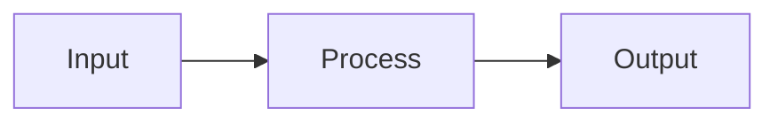

# Template: Kiến trúc Hệ thống

> Mô tả kiến trúc tổng quan của hệ thống [Tên hệ thống].

---

## Mục lục
1. [Tổng quan](#1-tổng-quan)
2. [Kiến trúc tổng thể](#2-kiến-trúc-tổng-thể)
3. [Cấu trúc Source Code](#3-cấu-trúc-source-code)
4. [Các Modules](#4-các-modules)
5. [Patterns và Practices](#5-patterns-và-practices)

---

## 1. Tổng quan

### 1.1. Mục đích
[Mô tả mục đích của hệ thống từ góc nhìn kỹ thuật]

### 1.2. Quy mô hệ thống

| Thông số | Giá trị |
|----------|---------|
| Số lượng users | [Expected users] |
| Transactions/ngày | [Expected load] |
| Availability | [SLA target] |

### 1.3. Stack công nghệ

| Thành phần | Công nghệ |
|------------|-----------|
| **Backend** | [Framework, Language, Version] |
| **Database** | [Database system] |
| **Cache** | [Cache solution] |
| **Message Queue** | [MQ solution] |
| **File Storage** | [Storage solution] |
| **Authentication** | [Auth solution] |
| **Frontend** | [Framework, Libraries] |
| **DevOps** | [CI/CD, Container, Orchestration] |

---

## 2. Kiến trúc tổng thể

### 2.1. High-Level Architecture

```
┌─────────────────────────────────────────────────────────────────────────────┐
│                              CLIENTS                                         │
│     ┌─────────────────┐  ┌─────────────────┐  ┌─────────────────┐           │
│     │   Web Browser   │  │   Mobile App    │  │  External API   │           │
│     └────────┬────────┘  └────────┬────────┘  └────────┬────────┘           │
└──────────────┼────────────────────┼────────────────────┼────────────────────┘
               │                    │                    │
               └────────────────────┼────────────────────┘
                                    │ HTTPS
                                    ▼
┌─────────────────────────────────────────────────────────────────────────────┐
│                           API GATEWAY / BACKEND                              │
│         Authentication │ Rate Limiting │ Logging │ Routing                   │
└─────────────────────────────────────────────────────────────────────────────┘
                                    │
                                    ▼
┌─────────────────────────────────────────────────────────────────────────────┐
│                         APPLICATION LAYER                                    │
│                                                                              │
│  ┌───────────────────┐  ┌───────────────────┐  ┌───────────────────┐        │
│  │    Module 1       │  │    Module 2       │  │    Module 3       │        │
│  └───────────────────┘  └───────────────────┘  └───────────────────┘        │
│                                                                              │
│        ┌───────────────────────────────────────────────────────┐            │
│        │                    Shared Kernel                       │            │
│        └───────────────────────────────────────────────────────┘            │
└─────────────────────────────────────────────────────────────────────────────┘
                                    │
                                    ▼
┌─────────────────────────────────────────────────────────────────────────────┐
│                          INFRASTRUCTURE                                      │
│  ┌──────────────┐  ┌──────────────┐  ┌──────────────┐  ┌──────────────┐     │
│  │   Database   │  │    Cache     │  │ Message Queue│  │    Storage   │     │
│  └──────────────┘  └──────────────┘  └──────────────┘  └──────────────┘     │
└─────────────────────────────────────────────────────────────────────────────┘
```

### 2.2. Communication Patterns

| Pattern | Mục đích | Khi sử dụng |
|---------|----------|-------------|
| [Pattern 1] | [Mô tả] | [Use case] |
| [Pattern 2] | [Mô tả] | [Use case] |

---

## 3. Cấu trúc Source Code

```
[project_root]/
├── docs/                           # Documentation
│
├── src/                            # Source code
│   ├── [Backend folder]/           # Backend application
│   │   ├── [Module 1]/
│   │   ├── [Module 2]/
│   │   └── [Shared]/
│   │
│   └── [Frontend folder]/          # Frontend application
│
└── tests/                          # Test code
    ├── unit/
    └── integration/
```

### Cấu trúc mỗi Module (nếu áp dụng)

```
[Module]/
├── Domain/            # Business logic, Entities
├── Application/       # Use Cases, DTOs
├── Infrastructure/    # Database, External Services
└── Presentation/      # Controllers, API
```

---

## 4. Các Modules

| Module | Mô tả | Tài liệu |
|--------|-------|----------|
| **[Module 1]** | [Mô tả chức năng] | [Link to doc](./[module_1]/README.md) |
| **[Module 2]** | [Mô tả chức năng] | [Link to doc](./[module_2]/README.md) |
| **[Shared]** | [Shared components] | [Link to doc](./shared/README.md) |

---

## 5. Patterns và Practices

### 5.1. Design Patterns

| Pattern | Mục đích |
|---------|----------|
| [Pattern 1] | [Mô tả mục đích] |
| [Pattern 2] | [Mô tả mục đích] |

### 5.2. Development Practices

| Practice | Mô tả |
|----------|-------|
| [Practice 1] | [Mô tả] |
| [Practice 2] | [Mô tả] |

### 5.3. [Diagram quan trọng - ví dụ: Data Flow]



---

## Tài liệu liên quan

- [Tài liệu nghiệp vụ](../1_business_docs/)
- [Tài liệu tính năng](../2_features_docs/)
- [Kế hoạch triển khai](../4_plans_docs/)

