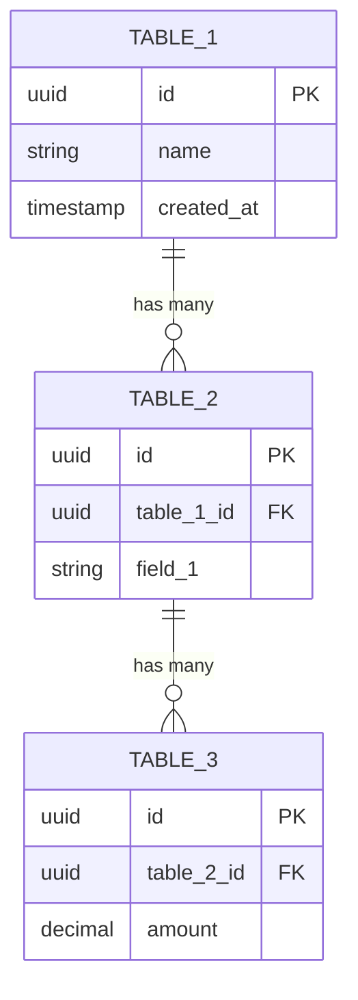

# Template: Database Schema - [Tên Module]

> Mô tả database schema cho module [Tên module].

---

## Tổng quan

[Mô tả ngắn về data model của module]

---

## Entity Relationship Diagram

---

## Chi tiết Tables

### [table_1]

| Column | Type | Nullable | Default | Mô tả |
|--------|------|----------|---------|-------|
| `id` | uuid | No | gen_random_uuid() | Primary key |
| `name` | varchar(200) | No | - | [Mô tả] |
| `status` | enum | No | 'active' | [Mô tả] |
| `created_at` | timestamp | No | now() | [Mô tả] |
| `updated_at` | timestamp | Yes | - | [Mô tả] |

**Indexes:**
- `idx_table_1_name` on (`name`)
- `idx_table_1_status` on (`status`)

**Constraints:**
- `pk_table_1` PRIMARY KEY (`id`)
- `uq_table_1_name` UNIQUE (`name`)

---

### [table_2]

| Column | Type | Nullable | Default | Mô tả |
|--------|------|----------|---------|-------|
| `id` | uuid | No | gen_random_uuid() | Primary key |
| `table_1_id` | uuid | No | - | FK → table_1 |
| `field_1` | varchar(500) | Yes | - | [Mô tả] |
| `field_2` | decimal(18,2) | No | 0 | [Mô tả] |

**Indexes:**
- `idx_table_2_table_1_id` on (`table_1_id`)

**Constraints:**
- `pk_table_2` PRIMARY KEY (`id`)
- `fk_table_2_table_1` FOREIGN KEY (`table_1_id`) REFERENCES `table_1`(`id`)

---

### [table_3]

[Mô tả tương tự]

---

## Enums

### [EnumName1]

| Value | Mô tả |
|-------|-------|
| `value_1` | [Mô tả] |
| `value_2` | [Mô tả] |

### [EnumName2]

| Value | Mô tả |
|-------|-------|
| `value_1` | [Mô tả] |
| `value_2` | [Mô tả] |

---

## Relationships

| From | To | Type | Mô tả |
|------|----|------|-------|
| table_1 | table_2 | 1:N | [Mô tả quan hệ] |
| table_2 | table_3 | 1:N | [Mô tả quan hệ] |

---

## Soft Delete Strategy

| Table | Soft Delete | Columns |
|-------|-------------|---------|
| table_1 | Yes | `is_deleted`, `deleted_at`, `deleted_by` |
| table_2 | No | - |

---

## Audit Strategy

| Table | Audit Columns |
|-------|---------------|
| table_1 | `created_at`, `updated_at`, `created_by`, `updated_by` |
| table_2 | `created_at`, `updated_at` |

---

## Tài liệu liên quan

- [Kiến trúc hệ thống](../architecture.md)
- [Tài liệu nghiệp vụ module](../../1_business_docs/[module]/)
- [API Endpoints](./api_endpoints.md)

