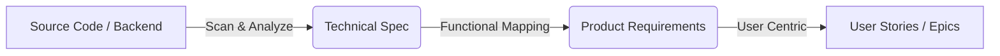

# SKILL: Reverse-Engineering Docs from Code

> Skill này hướng dẫn quy trình tạo tài liệu PO từ code/HDSD có sẵn - sử dụng workflow "Reverse-PO" để đảm bảo tính chính xác kỹ thuật.

---

## Khi nào sử dụng

- Dự án đã có source code nhưng chưa có tài liệu
- Có code Backend (API, Schema) muốn chuyển thành User Story
- Cần map chính xác tính năng hệ thống với nhu cầu người dùng

---

## Quy trình

### Workflow: "Reverse-PO"

### Phase 1: Code to Tech Spec (Automated/Semi-Auto)

**Mục tiêu**: Tạo ra "Sự thật kỹ thuật" (Technical Truth) trước khi suy diễn ra User Story.

1.  **Input**: Scan Code (Controller, Service, Entity).
2.  **Action**:
    *   List toàn bộ APIs.
    *   List Database Schema.
    *   Identify Logic quan trọng (Validation, Scheduler, Integration).
3.  **Output**: File `02_technical_specs/[module_name]_spec.md`
    *   *Sử dụng template*: `_template_tech_spec.md`

### Phase 2: Tech Spec to Feature Map (Analysis)

**Mục tiêu**: Gom nhóm kỹ thuật thành tính năng (Feature).

1.  **Analyze**: Đọc file Tech Spec ở Phase 1.
2.  **Grouping**:
    *   Nhóm các API liên quan (VD: `createOrder`, `cancelOrder`, `getOrder`) thành 1 **Feature**.
    *   Xác định Feature này phục vụ ai (Admin, User, System)?
3.  **Mapping**:
    *   Feature A -> Epic X
    *   Feature B -> Epic Y

### Phase 3: Feature to User Story (Human-centric)

**Mục tiêu**: Viết ngôn ngữ người dùng (Business Language).

1.  **Input**: Feature List từ Phase 2.
2.  **Action**: Viết User Story theo chuẩn INVEST.
    *   **User Story Statement**: As a [Role] I want [Feature]...
    *   **Acceptance Criteria**: Dựa trên Logic Validation trong Tech Spec.
    *   **Technical Link**: Thêm section "Technical Implementation" trong User Story link ngược về Tech Spec.
3.  **Output**: File `01_product_requirements/user_stories/US-XXX.md`

---

## Mapping Table (Rule of Thumb)

| Code Element | Doc Type | Location |
|--------------|----------|----------|
| `Controller` / `API` | **Tech Spec** (API Section) | `02_technical_specs` |
| `Entity` / `Table` | **Tech Spec** (DB Section) | `02_technical_specs` |
| `Service` Logic | **Tech Spec** (Logic) / **AC** (Validation) | - |
| **User Goal** | **User Story** | `01_product_requirements` |
| **Large Feature** | **Epic** | `01_product_requirements` |

---

## Templates

- **Technical Spec**: [`_template_tech_spec.md`](../../resources/templates/02_technical_specs/_template_tech_spec.md)
- **User Story**: [`_template_user_story.md`](../../resources/templates/01_product_requirements/_template_user_story.md)
- **Epic**: [`_template_epic.md`](../../resources/templates/01_product_requirements/_template_epic.md)

---

## Checklist

- [ ] Scan Code -> Tạo `02_technical_specs/`
- [ ] Review Tech Spec đúng với Code chưa?
- [ ] Từ Tech Spec -> List danh sách Features
- [ ] Viết User Story trong `01_product_requirements/`
- [ ] Link User Story về Tech Spec (Traceability)
