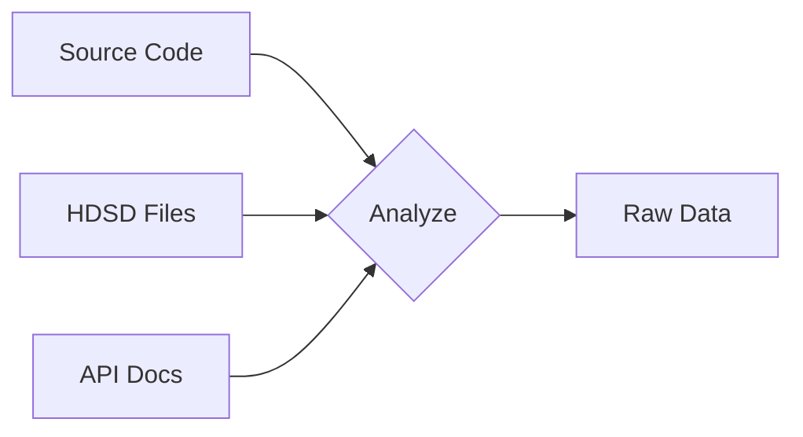

# SKILL: Reverse-Engineering Docs from Code

> Skill này hướng dẫn quy trình tạo tài liệu PO từ code/HDSD có sẵn - khác với quy trình planning-first truyền thống.

---

## Khi nào sử dụng

- Dự án đã có source code nhưng chưa có tài liệu
- Có HDSD (Hướng dẫn sử dụng) dạng docx cần chuyển đổi
- Cần hệ thống hóa tài liệu cho dự án legacy

---

## Quy trình

### Phase 1: Thu thập (Collect)



**Inputs cần thu thập:**
1. **Source code**: Xem folder structure, entities, APIs
2. **HDSD files**: Đọc file docx bằng python-docx
3. **Database schema**: Nếu có access
4. **Existing docs**: README, comments trong code

### Phase 2: Phân tích (Analyze)

**Bước 1: Xác định Modules**
```
Từ folder structure/services → Module mapping
```

**Bước 2: Xác định Epics**
```
Từ features trong HDSD → Epic breakdown
Mỗi chức năng lớn → 1 Epic
```

**Bước 3: Xác định User Stories**
```
Từ các bước trong HDSD → User Story
Mỗi thao tác cụ thể → 1 Story
```

### Phase 3: Mapping

| Nguồn | Đầu ra |
|-------|--------|
| Service/Controller | Module doc |
| Feature section (HDSD) | Epic |
| Chức năng cụ thể (HDSD) | User Story |
| Mục đích sử dụng | User Story Statement |
| Các bước thao tác | Acceptance Criteria |
| Lưu ý quan trọng | Technical Notes |

### Phase 4: Generate

Sử dụng templates tương ứng:
- `_template_module.md` → Module docs
- `_template_epic.md` → Epic docs
- `_template_user_story.md` → User Story docs
- `_template_hdsd.md` → HDSD markdown (nếu cần giữ format HDSD)

---

## Quy tắc áp dụng

### R1: HDSD Paragraph → User Story Statement

```
"Mục đích sử dụng" trong HDSD → "As a ... I want to ... So that ..."

Ví dụ:
HDSD: "Chức năng đăng nhập giúp xác thực danh tính người dùng..."
→ As a User
   I want to đăng nhập vào hệ thống
   So that tôi có thể truy cập các tính năng theo quyền của mình
```

### R2: Các bước thao tác → Acceptance Criteria

```
Mỗi "Bước" trong HDSD → 1 AC

Ví dụ:
HDSD: "Bước 1: Nhấn nút Đăng nhập với Google"
     "Bước 2: Chọn tài khoản Gmail"
→ AC1: Login via Google
   Given màn hình đăng nhập
   When nhấn "Đăng nhập với Google"
   Then redirect đến Google OAuth
```

### R3: Đối tượng sử dụng → Target Users

```
"2.2 Đối tượng sử dụng" trong HDSD → Target Users section trong Epic

Ví dụ:
HDSD: "Admin hệ thống, Trợ lý Trưởng phòng"
→ | Role | Description | Permission |
  | Admin | Quản trị viên hệ thống | Full |
  | TP Trợ lý | Trợ lý trưởng phòng | Limited |
```

### R4: Lưu ý quan trọng → Technical Notes / Risks

```
Section "Lưu ý" trong HDSD → Technical Notes hoặc Risks

Ví dụ:
HDSD: "Email phải nhập đúng chính tả vì hệ thống không hiển thị gợi ý"
→ Technical Notes: Email validation không có autocomplete
```

---

## Command đọc HDSD (docx)

```python
# Đọc file docx
from docx import Document
doc = Document('path/to/file.docx')
print('\n'.join([p.text for p in doc.paragraphs]))
```

---

## Checklist

- [ ] Thu thập tất cả source materials (code, HDSD, API docs)
- [ ] Xác định modules từ service structure
- [ ] Map features từ HDSD → Epics
- [ ] Map chức năng cụ thể → User Stories
- [ ] Generate docs theo templates
- [ ] Cross-reference links giữa các docs
- [ ] Review với stakeholders

---

## Templates liên quan

- [`_template_module.md`](../../templates/01_business_docs/_template_module.md)
- [`_template_epic.md`](../../templates/02_features_docs/_template_epic.md)
- [`_template_user_story.md`](../../templates/02_features_docs/_template_user_story.md)
- [`_template_hdsd.md`](../../templates/01_business_docs/_template_hdsd.md)
